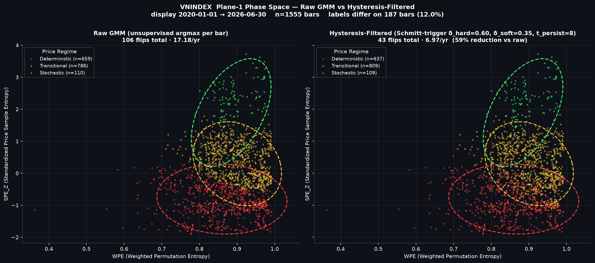

# Entropy Regime Research

**Code, validation scripts, and frozen outputs supporting a journal-submission
paper on entropy-derived market-regime informativeness across a heterogeneous
cross-market panel.**

This repository is the public reproducibility archive referenced on the
manuscript's title page. The manuscript is under double-anonymized review, so its
exact title and author block are withheld from this README until acceptance;
everything needed to audit the pipeline and reproduce every reported number is
here.

A companion production system (live dashboard + agent layer) exists in a separate
repository; its reference is withheld during double-anonymized review and will be
restored upon acceptance. This repo is research-only.

**Canonical reproducibility tag for the submitted manuscript:
`v3.6-jfds-submission`.** Reported numbers reproduce against the frozen outputs at
this tag; the pre-registration legacy statistics additionally carry in-script
numerical regression assertions (`atol = 1e-4`).

> Earlier tags are preserved where they are and are **not** re-pointed.
> `v3.5-rps-first` corresponds to an earlier state and predates the
> deterministic-seeding re-execution described below, so per-market direction
> estimates differ there. The cross-market magnitude result is identical at both
> tags on all twenty-seven markets.

## The pipeline

The paper's analysis is a five-layer pipeline. Every layer is independently
runnable and every layer's constants are pinned (see
[Research invariants](#research-invariants)).

```
┌────────────────────────────────────────────────────────────────────────────┐
│ 1. DATA INGESTION                                                          │
│    Daily OHLCV pulled from 2018-01-01 → 2026-06-30                         │
│    vnstock (VNINDEX) · TradingView/tvdatafeed (BVB:BET)                    │
│    yfinance (remaining international indices and crypto assets)            │
├────────────────────────────────────────────────────────────────────────────┤
│ 2. ENTROPY FEATURE ENGINEERING            skills/quant_skill.py            │
│    WPE  — weighted permutation entropy (m=3, τ=1, window=22)               │
│    SPE_Z — price sample entropy (m=2, r=0.2σ, window=60), standardized     │
│            by a strictly BACKWARD rolling 504-day Z-score (no look-ahead). │
│    The 504-day window consumes 2018–2019 as burn-in → labeled bars begin   │
│    late Mar–Apr 2020 (crypto: Jul 2019); labeled analysis window is        │
│    2020-01-01 → 2026-06-30 (post-COVID by construction).                   │
├────────────────────────────────────────────────────────────────────────────┤
│ 3. REGIME CLASSIFICATION                  skills/ds_skill.py               │
│    GMM on raw [WPE, SPE_Z] (K=3, full covariance, n_init=10, seed 42)      │
│    → three regimes: Deterministic / Transitional / Stochastic              │
│    + Schmitt-trigger hysteresis post-filter on posterior probabilities     │
│      (δ_hard=0.60, δ_soft=0.35, t_persist=8) → filtered labels             │
├────────────────────────────────────────────────────────────────────────────┤
│ 4. FORWARD-VOLATILITY TARGET                                               │
│    Forward 20-day annualized realized volatility per bar                   │
├────────────────────────────────────────────────────────────────────────────┤
│ 5. HYPOTHESIS TESTS                       validation/*.py                  │
│    H1 direction  — causal forest DML + Purged K-Fold (K=5, 20-bar embargo) │
│                    graded against a rotation-placebo calibration           │
│    H2 magnitude  — Kruskal–Wallis H × Retail Participation Share (primary) │
│                    MSCI tier retained as a descriptive stratifier only     │
│    H3 geometry   — Transitional-band occupancy vs the registered bounds    │
│    H4 structure  — block-permutation temporal-structure prerequisite       │
│    H5 robustness — hysteresis parameter transport + per-market re-calib    │
│    + n=27 panel expansion, Chronos and Gaussian-HMM head-to-heads          │
└────────────────────────────────────────────────────────────────────────────┘
```

Feature recipe pinning: [validation/_features.py](validation/_features.py) is the
single entry point every test imports (`run_full_pipeline()`); no script rebuilds
features ad hoc, which keeps all tests cross-comparable.

## Headline findings (as submitted)

The five pre-registered propositions are scored against the falsification
conditions frozen at commit `b130b0f`. **Two hold and three do not**, and the
paper reports the failures with the same weight as the survivor.

1. **Cross-market magnitude (H2) — holds.** Regime informativeness, the
   Kruskal–Wallis *H* by which a market's own three-state entropy partition
   separates its own forward 20-day realized volatility, is ordered across
   markets by Retail Participation Share: ρ = 0.583 (p = 0.0014, n = 27) on raw
   labels, 0.549 (p = 0.003) on filtered. The registered composite itself is
   scored on the eight-market panel, where it passes both gates
   (ρ = 0.762 / 0.833). MSCI development tier retains no residual association
   once participation is held fixed and is reported as a descriptive stratifier,
   not an explanatory variable.
2. **Temporal structure (H4) — holds.** Every market's filtered flip rate falls
   below the 5th percentile of its own shuffled null (p < 0.01; 8/8 at n = 8,
   27/27 at n = 27), under label shuffling and under block permutation.
3. **Direction (H1) — rejected, and the calibration that removed it travels.**
   A rotation placebo preserves a market's label sequence exactly while
   destroying its alignment with outcomes, so any interval excluding zero on a
   rotated series is a false positive by construction. The causal-forest
   asymptotic intervals exclude zero on **20.6%** of such rotations against a
   nominal 5%. Priced in, a cross-market homogeneity test moves from nominal
   rejection to none (I² = 0%). The paper therefore does **not** claim that the
   regime–volatility direction varies across markets.
4. **Regime composition (H3) — rejected at the powered panel size.** The
   registered frontier-minus-developed gap in Transitional occupancy reverses
   sign (−2.7 pp) and five frontier markets breach the registered floor.
5. **Parameter transport (H5) — rejected.** Settings calibrated on one market
   move Transitional occupancy by more than the registered bound on four of
   twenty-seven markets.

**Scope, stated with the finding.** The labels carry no incremental
out-of-sample forecasting value: an expanding-window HAR-RV augmented with them
gains nothing Diebold–Mariano-significant at any market. This is a measured
regularity in market structure, not a forecasting instrument. The measurement is
also in-sample — the mixture is fitted on the full window — though an
out-of-sample labeling control shows that full-sample fitting is not what
produces the cross-market ordering.

## Reproducing the paper's numbers

No build step. Python 3.12 with numpy / scipy / pandas / scikit-learn / econml /
ruptures. All seeds pinned (42); set `PYTHONHASHSEED=0` before running, since a
process-salted hash was the cause of a run-to-run instability that the archive at
this tag has corrected. Outputs land in
[validation/results_v2/](validation/results_v2/) as JSON / CSV / PNG.

```bash
# Pre-registered suite, scored as registered
python validation/scoring/score_h1_h5_as_registered.py   # H1-H5 verbatim against b130b0f
python validation/scoring/compare_n8_vs_n27.py           # both panel sizes side by side

# The finding (H2) and its controls
python validation/h2_magnitude/h2_eta_squared_n27.py          # Eq. (1): rho(H, RPS) at n = 27
python validation/h2_magnitude/h2_calibrated_kwh.py           # the same statistic under its own rotation null
python validation/controls/h2_simplevol_control.py        # rolling-volatility feature control
python validation/controls/h6_chronos_8market.py          # foundation-model head-to-head

# Direction (H1) and the calibration that grades it
python validation/h1_direction/h1_dml_cpcv.py                 # canonical CF-DML + Purged K-Fold
python validation/h1_direction/h1_dml_cpcv_n27.py             # expanded panel
python validation/h1_direction/dml_monte_carlo_stability.py   # estimator Monte-Carlo noise

# Supporting hypotheses
python validation/h3_h4_h5/hysteresis_cross_market_v2.py  # H3 + H4
python validation/h3_h4_h5/hysteresis_robustness_v2.py    # H5 (n = 8)
python validation/h3_h4_h5/h5_n27.py                      # H5 (n = 27)

# Panel properties reported in the data section and limitations
python validation/panel_properties/dependence_aware_inference.py  # cross-market dependence, block nulls
python validation/panel_properties/h_comovement_check.py          # is that dependence present in H itself?
python validation/panel_properties/series_length_diagnostic.py    # usable-history confound
python validation/panel_properties/subperiod_stability.py         # is the ordering uniform in time?
python validation/panel_properties/causal_labeling_check.py       # out-of-sample labeling control
```

Scripts superseded during revision are retained under
[validation/attic/](validation/attic/) rather than deleted, so an earlier result
can always be traced to the script that produced it.

### Manuscript object → script → frozen output

| Manuscript object | Script | Frozen output (`validation/results_v2/`) |
|---|---|---|
| Table 2 (five propositions scored) | `score_h1_h5_as_registered.py`, `compare_n8_vs_n27.py` | `h1_h5_as_registered.json`, `h1_h5_n8_vs_n27.json` |
| Eq. (1), Figure 2 (ρ(H, RPS), n = 27) | `h2_eta_squared_n27.py` | `n27_experiment/h2_eta_squared_n27.json` |
| §3.6 usable-history property | `series_length_diagnostic.py` | `series_length_diagnostic.json` |
| §3.6 panel dependence | `dependence_aware_inference.py`, `h_comovement_check.py` | `dependence_aware_inference.json`, `h_comovement_check.json` |
| §4.3 feature-representation control | `h2_simplevol_control.py` | `h2_simplevol_control.json` |
| §4.4, App F.4 (per-market direction + grading) | `h1_dml_cpcv.py`, `h1_dml_cpcv_n27.py` | `h1_dml_cpcv.json`, `n27_experiment/h1_dml_cpcv_n27.json` |
| §4.5, §6.6 (out-of-sample economic value) | `harv_economic_value.py` | `harv_economic_value.json` |
| §5.3, App E.5/E.7/E.8 (H5 transport) | `hysteresis_robustness_v2.py`, `h5_n27.py` | `h5_refined.csv`, `n27_experiment/h5_n27.{json,csv}` |
| §7 sub-period stability | `subperiod_stability.py`, `causal_labeling_check.py` | `subperiod_stability.json`, `causal_labeling_check.json` |
| App B.5 cross-market battery | `link_b_tests.py` + n27 variants | `link_b_tests.json`, `n27_experiment/link_b_*.json` |
| App B.6 mediation power | `herding_coherence_mediator.py`, `herding_vol_dynamics.py` | `n27_experiment/herding_*.json` |
| App C.1–C.3 (K-grid, flip rates, breakpoints) | `gmm_k_sensitivity.py`, `hysteresis_cross_market_v2.py`, `structural_breaks.py` | `gmm_k_sensitivity.json`, `hysteresis_summary_v2.csv`, `structural_breaks.json` |
| App F.6–F.7 (rotation placebo, calibrated KW-H) | `h1_dml_cpcv.py` placebo battery, `h2_calibrated_kwh.py` | `h1_dml_cpcv.json`, `h2_calibrated_kwh.json` |
| App G.1 (cascade composite MC) | `h2_cascade.py` | `h2_cascade.json` |
| App H (Chronos, Gaussian HMM) | `h6_chronos_8market.py`, `hmm_baseline.py` | `h6_chronos_8market.json`, `hmm_baseline.json` |
| App I (n = 27 panel) | `h2_eta_squared_n27.py`, `h1_dml_cpcv_n27.py` | `n27_experiment/*.json` |

The manuscript text itself is deliberately not tracked here (it is under
double-anonymized review); this repository carries the code and the frozen
outputs that back every reported number.

## Plane-1 phase space — raw GMM vs hysteresis-filtered



Both panels show the **same** GMM (k = 3, full covariance, random_state = 42) fit
on `[WPE, SPE_Z]` for VNINDEX. The dashed ellipses are the 2-σ confidence regions
of the three clusters and are identical between panels — only the **per-bar
labelling rule** differs:

- **Left (Raw GMM)** — argmax of the GMM posterior at each bar, independent of
  temporal context.
- **Right (Hysteresis-Filtered)** — Schmitt-trigger state machine over the same
  posteriors (δ_hard = 0.60, δ_soft = 0.35, t_persist = 8), which cuts the flip
  rate by roughly half and holds the previously-held regime against an
  instantaneous argmax flip.

This figure is a mechanism illustration and was rendered on the registration-era
window; the flip rates quoted in the manuscript are computed on the canonical
window, where VNINDEX carries 6.97 filtered flips per year against a shuffled-null
mean of 140.25. Reproduced by
[`regime_phase_space_compare.py`](validation/diagnostics/regime_phase_space_compare.py).

## Pre-registration

Hypotheses H1–H5 are frozen at commit `b130b0f` (2026-04-18):
[pre_registration/hypotheses_v2_combined.md](pre_registration/hypotheses_v2_combined.md).
Scientific-foundation audit:
[pre_registration/critique.md](pre_registration/critique.md). Frozen first-run
outputs are archived under
[validation/results_v2/prereg_b130b0f/](validation/results_v2/prereg_b130b0f/).

Three departures from the registration are disclosed in the manuscript rather
than absorbed: one frontier market was substituted from the registered candidate
list; H3 was later restated; and the primary predictor was superseded from the
registered composite to its participant core, on a record committed together with
the first canonical results and therefore not strictly outcome-blind. All
post-registration analyses are additive and none alters a pre-registered result.

Two data-integrity issues on the Romanian series are documented in full in the
manuscript: a vendor-side revision of an archived price history, and the deeper
finding that the identifier originally used was the exchange operator's listed
stock rather than the intended index. The canonical analysis uses the index
(BVB:BET), and every conclusion resting on the mis-specified series is voided.

## Repository structure

```
pre_registration/        Frozen H1-H5 pre-registration + scientific-foundation audit
validation/              Pre-registered H1-H5 scripts + journal-submission extensions
                         + appendix robustness redos
validation/attic/        Superseded one-shot scripts, retained for provenance
validation/results_v2/   JSON / CSV / PNG frozen outputs + prereg_b130b0f/ archive
skills/                  Core computation modules (quant_skill, ds_skill, data_skill)
scripts/                 Calibration + feature-extraction helpers
docs/                    Architectural diagram images
CONTEXT.md               Project state-of-play anchor
architecture.md          Detailed system architecture
```

Cover letters, title pages, lab notebooks, and audit logs stay in a private
workspace and are not tracked here.

## Research invariants

These constants are pinned across the canonical pipeline; sweeping any of them
requires a new branch and a new tag.

| Component | Value |
|-----------|-------|
| Weighted Permutation Entropy (WPE) | m = 3, τ = 1, rolling window = 22 |
| Price Sample Entropy (SampEn) | m = 2, r = 0.2σ, rolling window = 60 |
| Standardised SampEn (SPE_Z) | strictly backward rolling Z-score, window = 504 (never global) |
| Plane-1 features | `[WPE, SPE_Z]`, raw scale, no transformer |
| Gaussian Mixture Model | k = 3 (fixed a priori), full covariance, n_init = 10, max_iter = 500, random_state = 42 |
| Hysteresis filter (production default) | δ_hard = 0.60, δ_soft = 0.35, t_persist = 8 |
| DML cross-fitting | Purged K-Fold, K = 5, 20-bar embargo; nuisance forests 200×6; final forest 300×6 |
| RNG seeding | `RNG_SEED + zlib.crc32(name)` — never `hash(name)`, which is process-salted |

Hysteresis was calibrated on VNINDEX post-2020 to a 4–10 flips / yr target band;
calibration source:
[scripts/calibrate_hysteresis.py](scripts/calibrate_hysteresis.py).

## Authors

Anonymized for double-anonymized peer review. The full author block, contact
details, and contribution statement appear on the manuscript title page and will
be restored here upon acceptance.

## License

MIT License for code. Please cite the paper if using the methodology.
