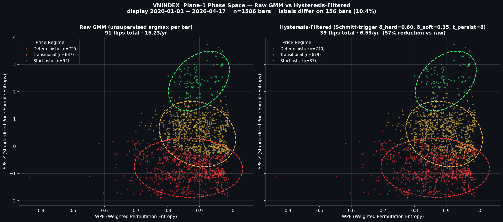

# Entropy Paradox Research

**Code and validation results supporting a journal-submission paper
on entropy-based market regime analysis.**

The repository hosts the validation code, regime-classification
machinery, and reproducibility artefacts for an investigation of how
information-theoretic complexity measures (weighted permutation
entropy, standardised price sample entropy) couple with market
microstructure across a heterogeneous post-COVID panel.

The active manuscript is in journal-submission preparation in a
private workspace; this public repository holds the validation code
and the JSON / CSV / PNG outputs that back every number in the
manuscript. Paper drafts and rationales themselves are not tracked
here.

**Companion production software**: [financial-entropy-agent](https://github.com/223hoangthai35/financial-entropy-agent)
holds the live Streamlit dashboard and LLM agent layer; this repo is
research-only.

## Purpose

Test whether the entropy–volatility relationship is a universal
phenomenon or a microstructure-conditioned one. Two complementary
questions:

1. **Per-market direction.** Does low entropy precede higher forward
   realised volatility (the *Paradox* direction), the *Inverted*
   direction, or no significant pattern? How does the answer vary
   across frontier, emerging, developed, and crypto markets?
2. **Cross-market magnitude.** Does the strength of regime
   discrimination (Kruskal–Wallis H of forward vol across three GMM
   regimes) scale monotonically with retail participation across the
   panel?

Both questions are evaluated under a fixed post-COVID
2020-01-01 → 2026-04-17 window with rolling 504-bar SPE_Z (no
look-ahead) and a Schmitt-trigger hysteresis post-filter on GMM
posteriors.

## Paper

### *Direction Heterogeneity and Magnitude Scaling in Cross-Market Entropy–Risk Coupling with Retail Participation: Evidence from a Stratified Eight-Market Panel (2020–2026)*

**Principal Contribution 1 — direction heterogeneity (empirical).**
The entropy–volatility direction is *not* universal; it tracks
microstructure. Under causal forest + double/debiased ML with Purged
K-Fold cross-fitting, frontier and retail-leaning markets read the
*Paradox* direction (low entropy precedes higher forward volatility,
consistent with behavioural coordination); developed markets read
*Inverted* or non-significant; cryptocurrency reads *Inverted* under
filtering. Apparent Paradox readings on developed markets under naive
K-Fold cross-fitting reflect future-data leakage, not substantive
structure.

**Principal Contribution 2 — cross-market magnitude scaling
(empirical).** Entropy-based regime-discrimination magnitude
(Kruskal–Wallis H) orders monotonically with retail participation
across the eight-market panel. The ordering holds under both raw and
hysteresis-filtered labels — filtering strengthens it — and is robust
to the FTSE Russell / MSCI tier-scoring scheme, the cascade RPS
specification (P1 authoritative / P2 bounds / P3 Bayesian), the
sample-size correction (η²), and the sensitivity suite. It is the
first cross-market test linking entropy-derived efficiency to an
ex-ante participant-ecology variable on a heterogeneous post-COVID
panel.

**Method.** Weighted permutation entropy and standardised price
sample entropy as features for a Gaussian mixture regime classifier
(k = 3, full covariance) with a Schmitt-trigger hysteresis post-filter
on posterior probabilities. Per-market direction estimated via causal
forest under DML with Purged K-Fold cross-fitting. Cross-market
magnitude tested under tier scoring and cascade RPS with three
data-quality phases (P1 authoritative point estimate, P2
competing-source bounds, P3 Bayesian posterior).

**Panel.** Eight markets — frontier: VNINDEX, BVB; emerging: KOSPI,
NIFTY; developed: SPX, FTSE, NIKKEI; crypto: BTC — over
2020-01-01 → 2026-04-17.

**Pre-registration.** Hypotheses H1–H5 are frozen at commit
`b130b0f` (2026-04-18):
[pre_registration/hypotheses_v2_combined.md](pre_registration/hypotheses_v2_combined.md).
Scientific-foundation audit:
[pre_registration/critique.md](pre_registration/critique.md). Every
manuscript number traces back to a JSON / CSV under
[validation/results_v2/](validation/results_v2/); the frozen first-run
outputs are archived under
[validation/results_v2/prereg_b130b0f/](validation/results_v2/prereg_b130b0f/).

## Plane-1 phase space — raw GMM vs hysteresis-filtered



Both panels show the **same** GMM (k = 3, full-covariance,
random_state = 42) fit on `[WPE, SPE_Z]` for VNINDEX over the
2018–2026 loading window. The dashed ellipses are the 2-σ confidence
regions of the three GMM clusters and are identical between panels —
only the **per-bar labelling rule** differs:

- **Left (Raw GMM)** — argmax of the GMM posterior at each bar,
  independent of temporal context. **91 flips total · 15.23 / year**.
- **Right (Hysteresis-Filtered)** — Schmitt-trigger state machine over
  the same posteriors (δ_hard = 0.60, δ_soft = 0.35, t_persist = 8).
  **39 flips total · 6.53 / year (57 % reduction vs raw)**.

Display window 2020-01-01 → 2026-04-17 (post-COVID), n = 1506 bars.
Labels differ on 156 bars (10.4 %) — these are the bars where
hysteresis "holds" the previously-held regime against an
instantaneous argmax flip. Reproduced by
[`regime_phase_space_compare.py`](validation/regime_phase_space_compare.py).

## Validation framework

The canonical pre-registered hypotheses (frozen at commit `b130b0f`,
2026-04-18) are tested by Phase 1 / 2 / 2b scripts. Journal-submission
extensions add a foundation-model comparison, a panel-expansion
robustness experiment, and a cascade specification of the
microstructure proxy.

### Pre-registered H1–H5

| Phase | Hypothesis | Script |
|-------|-----------|--------|
| 1 | H1 — paradox direction (pairwise Det vs Sto, Cliff's δ + block-bootstrap CI + Newey-West HAC) | [validation/cross_market_v2.py](validation/cross_market_v2.py) |
| 1 | H2 — microstructure gradient (Spearman ρ on Retail Participation Share) | [validation/h2_rps_validation.py](validation/h2_rps_validation.py) |
| 2 | H3 — Transitional persistence (block-bootstrap CI on p_tra + continuous companion) | [validation/hysteresis_cross_market_v2.py](validation/hysteresis_cross_market_v2.py) |
| 2 | H4 — temporal structure (block-permutation null at block ∈ {5, 10, 20}) | same as H3 |
| 2b | H5 — hysteresis-parameter robustness (joint circular-block bootstrap, dead-zone rule) | [validation/hysteresis_robustness_v2.py](validation/hysteresis_robustness_v2.py) |

### Journal-submission extensions

Built on top of the canonical pipeline, additive (no pre-registered
result is altered):

- **DML / causal-forest stack for H1.** Per-market Det–Sto direction
  estimated under double/debiased ML with Purged K-Fold cross-fitting
  to remove the future-leakage that contaminates naive K-Fold:
  [`h1_dml.py`](validation/h1_dml.py),
  [`h1_dml_cpcv.py`](validation/h1_dml_cpcv.py),
  [`h1_dml_filtered.py`](validation/h1_dml_filtered.py),
  [`h1_dml_no_lagrv.py`](validation/h1_dml_no_lagrv.py),
  [`h1_dml_tsaware.py`](validation/h1_dml_tsaware.py),
  [`h1_method_comparison.py`](validation/h1_method_comparison.py),
  [`_cpcv_splitter.py`](validation/_cpcv_splitter.py).
- **Cascade RPS specification for H2.** Three data-quality phases
  (P1 authoritative point estimate, P2 competing-source bounds,
  P3 Bayesian posterior) plus tier-score variants and an η²
  sample-size-adjusted effect size:
  [`h2_cascade.py`](validation/h2_cascade.py),
  [`h2_cascade_pseiP2.py`](validation/h2_cascade_pseiP2.py),
  [`h2_rps_bounds.py`](validation/h2_rps_bounds.py),
  [`h2_rps_validation_corrected.py`](validation/h2_rps_validation_corrected.py),
  [`h2_tier_based.py`](validation/h2_tier_based.py),
  [`h2_tier_rank_sensitivity.py`](validation/h2_tier_rank_sensitivity.py),
  [`h2_decomposition_sensitivity.py`](validation/h2_decomposition_sensitivity.py),
  [`h2_sensitivity_spe_z.py`](validation/h2_sensitivity_spe_z.py),
  [`h2_eta_squared.py`](validation/h2_eta_squared.py),
  [`h2_bayesian_uq.py`](validation/h2_bayesian_uq.py).
- **Foundation-model head-to-head (Chronos vs entropy).**
  [`h6_chronos_8market.py`](validation/h6_chronos_8market.py)
  extracts Chronos-T5-small encoder embeddings on rolling 22-day
  return windows and runs the identical GMM + hysteresis pipeline
  for cross-representation comparison.
- **Per-market hysteresis grid.**
  [`h5_per_market_grid_search.py`](validation/h5_per_market_grid_search.py)
  sweeps δ_hard / δ_soft / t_persist per market against the 4–10
  flips / yr target band.
- **n = 27 panel expansion.**
  [`markets_n27.py`](validation/markets_n27.py) plus
  [`h1_dml_cpcv_n27.py`](validation/h1_dml_cpcv_n27.py),
  [`h2_cascade_n27.py`](validation/h2_cascade_n27.py),
  [`h2_eta_squared_n27.py`](validation/h2_eta_squared_n27.py).
  Robustness check that the 8-market scaling holds on a wider panel.
- **Other additions.** Structural-breaks tester
  ([`structural_breaks.py`](validation/structural_breaks.py)),
  GMM-k sensitivity ([`gmm_k_sensitivity.py`](validation/gmm_k_sensitivity.py)),
  link-B retail-channel tests ([`link_b_tests.py`](validation/link_b_tests.py)),
  Phase-2 revision addenda ([`phase2_revision_addenda.py`](validation/phase2_revision_addenda.py)).

### Appendix robustness redos

GARCH(1,1) vs Rolling-22 forecast benchmark on VNINDEX, tail-risk
Lift across the 8-market panel with adaptive per-market quantile
thresholds, and an entropy vs simple-volatility vs combined feature
comparison:
[`garch_vnindex_v2.py`](validation/garch_vnindex_v2.py),
[`tail_lift_8market.py`](validation/tail_lift_8market.py),
[`entropy_vs_simple_8market.py`](validation/entropy_vs_simple_8market.py).

All outputs land in [validation/results_v2/](validation/results_v2/).

## Repository structure

```
pre_registration/        Frozen H1-H5 pre-registration + scientific-foundation audit
validation/              Pre-registered H1-H5 scripts + journal-submission extensions
                         + appendix robustness redos
validation/results_v2/   JSON / CSV / PNG outputs + prereg_b130b0f/ frozen archive
skills/                  Core computation modules (quant_skill, ds_skill, data_skill)
scripts/                 Calibration + feature-extraction helpers
docs/                    Architectural diagram images for the README
CONTEXT.md               Project state-of-play anchor for new sessions
architecture.md          Detailed system architecture
```

Manuscript drafts, lab notebooks, and audit reports stay in a private
workspace and are not tracked in this repository.

## Research invariants

These constants are pinned across the canonical pipeline; sweeping
any of them requires a new branch and a new tag.

| Component | Value |
|-----------|-------|
| Weighted Permutation Entropy (WPE) | m = 3, τ = 1, rolling window = 22 |
| Price Sample Entropy (SampEn) | rolling window = 60 |
| Standardised SampEn (SPE_Z) | rolling Z-score, window = 504 (no global) |
| Plane-1 features | `[WPE, SPE_Z]`, raw scale, no transformer |
| Gaussian Mixture Model | k = 3, full covariance, n_init = 10, max_iter = 500, random_state = 42 |
| Hysteresis filter (production default) | δ_hard = 0.60, δ_soft = 0.35, t_persist = 8 |

Hysteresis was calibrated on VNINDEX post-2020 to a 4–10 flips / yr
target band (achieves ~7.8 / yr); calibration source:
[scripts/calibrate_hysteresis.py](scripts/calibrate_hysteresis.py).

## Author

Hoang Thai — Independent Research (2026)
Pre-MSc candidate, Data Science applications 2027

## License

MIT License for code. Please cite the paper if using the methodology.
