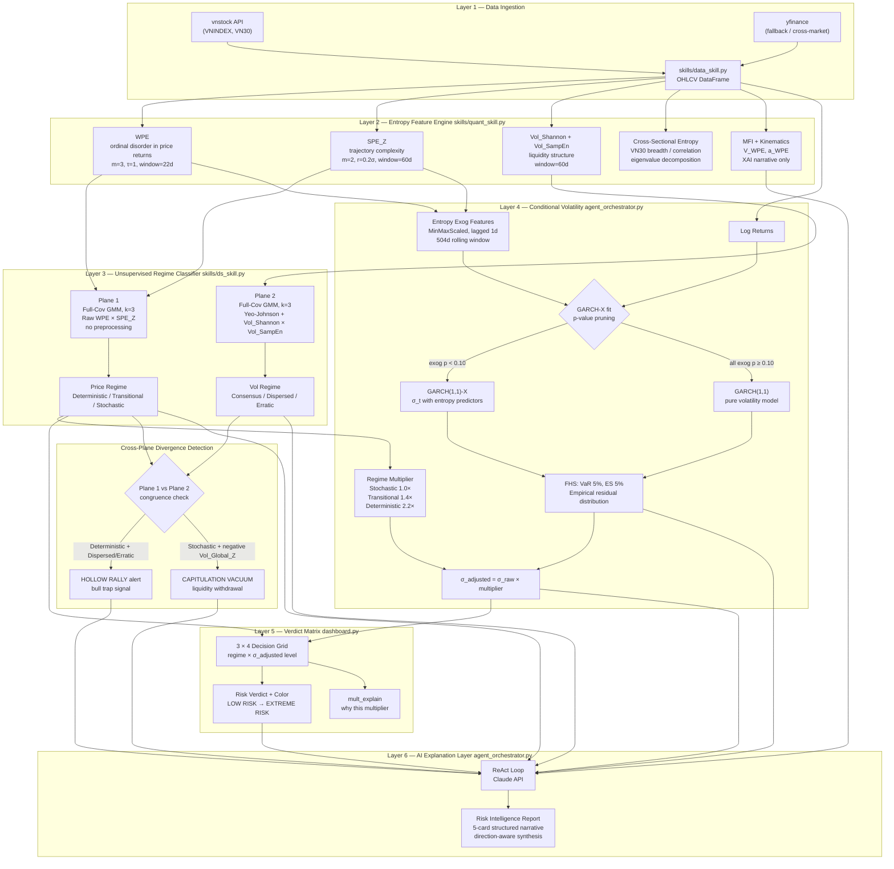

# ARCHITECTURE.md

## Financial Entropy Agent — Technical Architecture Specification

**Version**: 7.0 (System-Thinking Revision)
**Classification**: Entropy-Driven Conditional Volatility Engine & Explainable AI Risk Terminal

---

## 1. Conceptual Model: What the System Actually Measures

Before code, there is a mental model. Every architectural decision traces back to one hypothesis:

> **Financial markets are Type-2 chaotic systems. In such systems, dangerous states are characterized by coordination — not chaos. Entropy measures the absence of coordination.**

This inverts the intuition from physical thermodynamics. In a gas, low entropy = ordered = stable. In a financial market, low entropy = participants moving together = herding = fragility. The system is built on this single inversion.

```
PHYSICAL INTUITION          FINANCIAL REALITY
──────────────────────────────────────────────────────
Low entropy  →  order       Low entropy  →  coordination
Order        →  stability   Coordination →  fragility
High entropy →  chaos       High entropy →  diversity
Chaos        →  danger      Diversity    →  resilience
```

**Three causal chains run in parallel**, each measuring the same underlying phenomenon — behavioral coordination — from a different angle:

```
PRICE STRUCTURE (Plane 1)           LIQUIDITY STRUCTURE (Plane 2)
─────────────────────────           ──────────────────────────────
  Do price movements follow           Is capital flow concentrated
  repeating ordinal patterns?         or dispersed across sessions?
          ↓                                       ↓
    WPE + SPE_Z                         Vol_Shannon + Vol_SampEn
          ↓                                       ↓
  Deterministic / Transitional /      Consensus / Dispersed /
  Stochastic                          Erratic/Noisy Flow
          ↓                                       ↓
   REGIME MULTIPLIER ←──────────────────────────────
          ↓
   GARCH σ_t × multiplier = σ_adjusted
          ↓
   VERDICT MATRIX (σ_adjusted × regime)
          ↓
   RISK INTELLIGENCE NARRATIVE
```

The Verdict Matrix exists because **the same σ_adjusted level carries different meaning depending on its structural source**. A 3% daily vol spike in a Stochastic (healthy) regime is a transient liquidity event. The same 3% in a Deterministic regime is a structural breakdown. The system captures this distinction that a single volatility number cannot.

---

## 2. System Map



---

## 3. Dual-Plane Design: Why Two Independent GMMs

The two GMM planes are kept strictly independent. They are never merged into a single feature space. This is a deliberate architectural constraint.

**Why separation matters:**

| | Plane 1 (Price) | Plane 2 (Volume) |
|:---|:---|:---|
| **Features** | WPE, SPE_Z | Vol_Shannon, Vol_SampEn |
| **Preprocessing** | None — raw topology preserved | Yeo-Johnson — right-skewed data |
| **What it measures** | Ordinal + amplitude structure of *price returns* | Concentration + complexity of *capital flow* |
| **Failure mode** | Would lose entropy geometry if normalized | Would produce biased GMM without normalization |

**Why divergence between planes is meaningful:**

When Plane 1 says Deterministic but Plane 2 says Dispersed, it means: *price structure is highly coordinated, but capital is not flowing in support of that structure*. This is the **Hollow Rally** pattern — a coordinated price move without broad liquidity backing, historically preceding sharp reversals.

When Plane 1 says Stochastic but Vol_Global_Z is strongly negative, it means: *price is healthy but institutional capital is exiting*. This is the **Capitulation Vacuum** — quiet price, invisible institutional withdrawal.

Neither pattern is detectable from a single plane.

---

## 4. GARCH Engine: Adaptive Exog Activation

The entropy features do not always improve the GARCH variance equation. During calm markets, entropy-based exogenous variables are statistically insignificant — they add noise, not signal. The engine handles this with explicit pruning:

```
FIT GARCH-X with [H_price, H_volume] as exogenous
    ↓
For each exogenous variable:
    if p-value > 0.10 → drop from model
    ↓
If all exogenous dropped:
    fall back to pure GARCH(1,1)
    entropy still active for regime classification
    ↓
If GARCH cannot fit (genuine error: missing arch dep, degenerate data):
    surface the error explicitly in the dashboard
    no composite-fallback path in v7.1
```

**Key insight**: Entropy is *always* contributing through regime classification (Layer 3). The question is only whether it also enters the variance equation. This adaptive activation prevents entropy from degrading GARCH accuracy during periods when structure is absent.

**v7.1 simplification**: Earlier prototypes routed cold-start runs (< 120 days of entropy features) into a deterministic "Tri-Vector Composite Risk" aggregate (V1 0.40, V2 0.40, V3 0.20). That fallback has been removed: the supported markets always have ≥ 120 days of history, and silently switching scoring methods made the dashboard's risk gauge non-comparable across runs. GARCH-X is now the single source of truth for the risk reading.

---

## 5. Verdict Matrix: The Decision System

The Verdict Matrix is the integration point where the quantitative pipeline produces a human-interpretable risk label. It exists to solve one specific failure mode: **a σ threshold alone cannot distinguish structural risk from transient liquidity noise**.

```
σ_adjusted \ Regime    STOCHASTIC       TRANSITIONAL      DETERMINISTIC
─────────────────────────────────────────────────────────────────────────
σ < 0.8%               LOW RISK         STRUCTURAL        STRUCTURAL
                        (green)          BUILD-UP          WARNING
                                         (yellow)          (orange) ←─ calm-before-storm
σ 0.8–1.5%             LOW-MODERATE     MODERATE RISK     STRUCTURAL
                        (green)          (yellow)          WARNING
                                                           (orange)
σ 1.5–2.5%             ELEVATED         HIGH RISK         HIGH RISK
                        VOLATILITY       (orange)          (orange)
                        (yellow)
σ > 2.5%               ELEVATED         HIGH RISK         EXTREME RISK
                        VOLATILITY       (orange)          (red)
                        (yellow) ←─ max for Stochastic
─────────────────────────────────────────────────────────────────────────
```

**Reading the matrix:**
- Stochastic + any σ → capped at ELEVATED VOLATILITY (yellow). The structural source is transient; the multiplier came from volume, not price regime. The narrative explicitly notes: *"this is a liquidity-driven spike, not a systemic structural breakdown."*
- Deterministic + low σ → STRUCTURAL WARNING (orange). This is the advance warning cell: entropy detects coordination building while volatility appears calm. Classic pre-crash topology.
- Deterministic + σ > 2.5% → EXTREME RISK (red). Both structural and quantitative thresholds breached simultaneously.

---

## 6. XAI Narrative Layer: Direction-Aware Synthesis

The AI narrative (Claude API, ReAct loop) does not simply restate numbers. It synthesizes across all layers with context the quantitative pipeline cannot encode:

**Direction-awareness** (Deterministic regime only):
- Price above SMA-20 + Deterministic → *coordinated rally, late-stage momentum, vulnerable to reversal*
- Price below SMA-20 + Deterministic → *institutional selling or panic, trend has structure*

**Entropy trajectory** (kinematic XAI):
- $V_{\text{WPE}} > 0$ (rising entropy) → disorder increasing → regime may be transitioning away from Deterministic
- $V_{\text{WPE}} < 0$ (falling entropy) → coordination intensifying → risk building

Kinematic indicators $V_{\text{WPE}}$ and $a_{\text{WPE}}$ are **narrative-only** — they never enter the GMM or GARCH pipeline. This separation is intentional: kinematics can be noisy on a single-day basis and would inject instability into the quantitative models.

**Five-card report structure:**
1. **Volatility Assessment** — GARCH σ, exog significance, regime multiplier explanation
2. **Price Regime** — GMM label, direction context, entropy trend
3. **Liquidity Structure** — Volume regime, Vol_Global_Z, capital flow interpretation
4. **Entropy Momentum** — $V_{\text{WPE}}$, $a_{\text{WPE}}$, trajectory narrative
5. **Tail Risk** — ES 5%, VaR 5%, cross-sectional breadth
6. **Conclusion** — Verdict + divergence alert (if any) + plain-language synthesis for non-technical readers

---

## 7. Design Invariants

These constraints are **not configurable**. Each exists for a documented reason. Changing them without re-validation invalidates the system's empirical results.

| Invariant | Value | Reason |
|:----------|:------|:-------|
| WPE: $m$, $\tau$, window | 3, 1, 22d | Calibrated on VNINDEX; 22d = 1 trading month |
| SampEn: $m$, $r$, window | 2, $0.2\sigma$, 60d | Standard physiological time-series parameters adapted for finance |
| Vol SampEn: $r$ | 0.2 (fixed) | Volume does not have the same local-σ scaling as price |
| GMM: $k$, covariance, n_init | 3, full, 10 | Three-phase physics analogy; full covariance captures true entropy geometry |
| GARCH exog pruning threshold | $p < 0.10$ | Prevents entropy from degrading point forecasts during calm periods |
| Risk rolling window | 504d | ~2 trading years; stable percentile estimation |
| Regime multipliers | 1.0×, 1.4×, 2.2× | Calibrated on VNINDEX forward volatility by regime |
| Plane 1 preprocessing | None | Raw WPE/SPE_Z topology must not be distorted before GMM |
| Plane 2 preprocessing | Yeo-Johnson | Right-skewed volume distributions bias GMM without transformation |
| Kinematics → GMM/GARCH | Forbidden | Noisy single-day derivatives would destabilize quantitative models |

---

## 8. Cross-Market Scope and Portability

The architecture is market-agnostic at the data and feature level. Three components are VNINDEX-specific and require re-calibration for new markets:

| Component | VNINDEX-Specific | Re-calibration Required |
|:----------|:----------------|:------------------------|
| `data_skill.py` | vnstock API | Replace with target market data source |
| Regime multipliers (1.0×, 1.4×, 2.2×) | Calibrated on VNINDEX forward vol by regime | Re-fit on new market's regime × forward vol distribution |
| VN30 breadth (cross-sectional entropy) | VN30 constituent list | Replace with target index constituents |

**Critical re-validation step**: Before deploying on a new market, confirm that the Entropy Paradox direction holds — i.e., Deterministic mean forward vol > Stochastic mean forward vol. Cross-market validation (V5) shows this is **not guaranteed**: S&P 500 shows an inverted relationship, driven by institutional market-making that makes "order" stabilizing rather than fragile. The same GMM architecture applies, but its interpretation depends on market microstructure.

---

## 9. Notes

- **No composite risk fallback**: v7.1 removed the legacy `calc_composite_risk_score()` aggregate. GARCH-X is the single risk pipeline. If `fit_garch_x()` fails, the dashboard surfaces the error rather than silently switching scoring methods.
- **`PowerTransformer`**: Applied to Plane 2 (Volume) only via `VolumeRegimeClassifier`. Plane 1 (Price) uses raw `[WPE, SPE_Z]` — the natural scale carries physical meaning and must not be normalized before GMM fitting.
- **Module boundaries (DRY)**:  Math logic belongs only in `quant_skill.py`. ML models belong only in `ds_skill.py`. `agent_orchestrator.py` and `dashboard.py` import from skills; they do not redefine functions.
