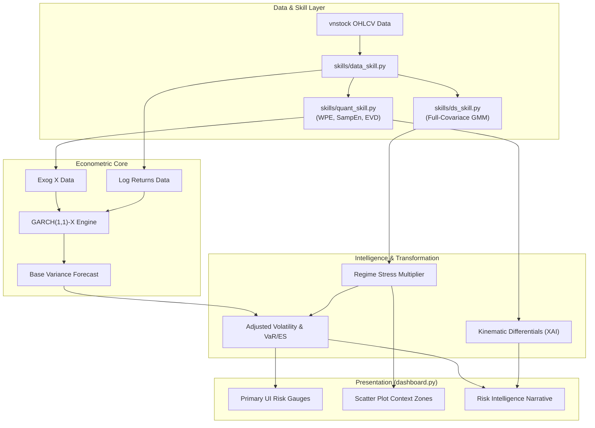

# ARCHITECTURE.md

## Financial Entropy Agent -- Technical Architecture Specification

**Version**: 5.0 (GARCH-X & Explainable AI Narrative Integration)
**Classification**: Entropy-Driven Conditional Volatility Engine & Diagnostic XAI Terminal

---

## 1. System Philosophy: From Numbers to Narratives

The system has evolved from a purely quantitative 0-100 composite risk scoring engine into a comprehensive **Explainable AI (XAI) Risk Terminal**. The core architectural pivot is the realization that raw entropy indices are more valuable when used as **exogenous predictors for volatility** and as triggers for **linguistic synthesis**, rather than being arbitrarily summed into gauge charts.

The legacy "Composite Risk Score" components and 5-day pattern fingerprinting have been replaced entirely by:
1. **The GARCH-X Engine**: A mathematical core forecasting risk where macro-thermodynamic "disorder" is injected into the equation.
2. **The Intelligence Report**: An XAI presentation layer highlighting Risk Multipliers and Trajectory Analysis.

---

## 2. Structural Layering

The codebase separates concerns into strictly parallel pipelines.

### Layer A: Unsupervised Phase Space (GMM Diagnostics)

This layer runs independently for **Plane 1 (Price)** and **Plane 2 (Liquidity)**, applying Gaussian Mixture Models to categorize the current environment with zero human thresholding.

#### A.1 Price Plane (Vector 1)
- **Features Input**:
  - $X$: `WPE` (Weighted Permutation Entropy)
  - $Y$: `SPE_Z` (Standardized Price Sample Entropy)
- **Classification Method**: Full-Covariance GMM ($k=3$) with absolutely **no PowerTransformer** normalizations.
- **Identified Regimes**: Stable, Fragile, Chaos.

#### A.2 Liquidity Plane (Vector 2)
- **Features Input**:
  - $X$: `Vol_Shannon` (Volume Concentration)
  - $Y$: `Vol_SampEn` (Volume Complexity)
- **Classification Method**: Full-Covariance GMM ($k=3$).
- **Identified Regimes**: Consensus Flow, Dispersed Flow, Erratic/Noisy Flow.

### Layer B: Cross-Sectional Breadth (Vector 3)

Operates strictly behind-the-scenes on VN30 index components.
- Extracts the **Eigenvalue Decomposition** of the 22-day rolling Pearson correlation matrix.
- Yields the Cross-Sectional Entropy ($S_{corr}$), quantifying whether the market is heavily glued together (High Risk of flash crash) or healthily fragmented.

---

## 3. The Quantitative Engine (GARCH-X)

Rather than the legacy system's min-max scaling combinations to compute risk mathematically, **Version 5.0 implements a unified Econometric Volatility Model**. 

### The Core Loop
```python
# Model initialization using the Python `arch` library 
# exog_vars = [H_price(WPE), H_volume(Shannon)]
am = arch_model(y, x=exog_vars, vol='GARCH', p=1, q=1, dist='skewt')
res = am.fit(...)
```

The system forecasts out-of-sample volatility ($\sigma_t$). However, to reflect structural market vulnerabilities detected by the GMM Phase Spaces, the agent applies the **Regime Stress Multiplier Protocol**.

1. Extract `current_regime` and `current_vol_regime`.
2. Map to empirically determined stress amplifiers:
   - Stable: 1.0x
   - Fragile: 1.4x
   - Chaos: 2.2x
3. Output **Adjusted Volatility** = Base $\sigma_t \times \text{Multiplier}$.

This Adjusted Volatility drives the primary risk gauge in the UI.

---

## 4. The XAI Linguistic Generator (Risk Intelligence Report)

The visual output replaces massive data tables with the **Risk Intelligence Report**. 
The system algorithmically parses the underlying outputs over four blocks:

1. **Volatility Assessment**: Interprets the raw statistical significance (p-values) of the Entropy vectors within the GARCH-X regression. If $p > 0.05$, the XAI informs the user that Entropy is acting purely as a regime classifier rather than a daily variance cluster predictor.
2. **Phase Space Diagnostics**: Synthesizes the Regime labels from Layer A. Emits a **Divergence Alert** if Price shows "Stable" but Liquidity shows "Erratic", predicting imminent repricing mechanisms.
3. **Kinematic Momentum**: Evaluates the velocity ($V_{WPE}$) and acceleration ($a_{WPE}$) using basic differential logic to explain the trajectory of market disorder.
4. **Tail Risk Observer**: Generates the Expected Shortfall ($ES_{5\%}$) narrative, modified by the Cross-Sectional ratio (Vector 3) to articulate if distribution tails are expanding or contracting.

---

## 5. Execution Pipeline



---

## 6. Deprecation List

- **Vector Combination Gauge**: The generic 0-100 integer score methodology is deprecated. Financial risk is explicitly quantified as Adjusted Daily Volatility $\sigma$ (%).
- **PowerTransformers**: No normalization algorithms are permitted to execute on the Phase Space prior to categorization. All data goes raw into the GMM to preserve topological reality.
- **Static Multi-Table UIs**: Replaced by dynamic, sentence-structured Explainable AI.
